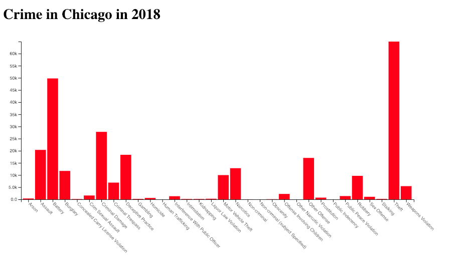
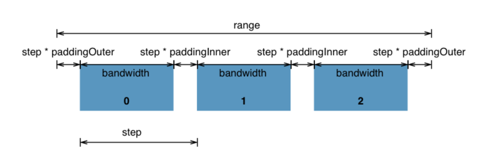

# Build a bar plot three different ways:

TKTK add info

# Let's build a bar plot!

We'll be creating our first bar plot using Chicago crime data, which is available on the [Chicago Data Portal](https://data.cityofchicago.org/Public-Safety/Crimes-2001-to-present/ijzp-q8t2). For creation of this plot, I have aggregated the data to find the total counts of each type of crime for each year. (See ipython notebook where I did this [here](data/transformChiCrimeData.ipynb).) Before getting started, open the data file (`ChiCrime.csv`) to see how the data is structured.

We're going to create a bar plot, showing the counts of each crime in Chicago. It will end up looking something like this:



**First off, you'll need to go to [this project's blocksbuilder link](https://blockbuilder.org/molliemarie/22c1107f4226f64cba9df6a1f4e09408) and fork it.** You can find the finished product [here](https://blockbuilder.org/molliemarie/06630abcdb4bc9f2dccd206df7850a42) for help / comparison along the way. 

And, here we go!

**Note:** Since [Mike Bostock](https://bost.ocks.org/mike/) (creator of d3.js) doesn't technically make valid HTML pages, we're not going to either — here's how we'll start our own empty HTML pages from here on out:

  ```
  <!DOCTYPE html>
  <meta charset="utf-8">

  <style type="text/css">
    /*css to go here*/
  </style>

  <body></body>

 <script src="https://d3js.org/d3.v4.min.js"></script>
 
  <script>
    //JS to go here
  </script>

  ```
  
## Steps:

### 1. Fork blocksbuilder project

If you haven't yet, go to [this project's blocksbuilder link](https://blockbuilder.org/molliemarie/22c1107f4226f64cba9df6a1f4e09408) and fork it. You'll notice the code is set up like above, plus I've added styling that will add a pink border around any svg we might draw.

  ```
  svg {
    border: 1px solid #f0f;
  }
  ```
  
  **Other things to note:**
  
  First, we're using the the `d3.csv()` module of [`d3-request`](https://github.com/d3/d3-request) to load in our data. This allows us to load in data from a csv file; the module transforms it from it's current format to the json format that d3.js likes. 
  
  ```
  // Reading in data here, then calling "ready" function:
  d3.csv("ChiCrime.csv", ready)
  ```
  
  Additionally, the code is being formatted so that it will be easier to use later. 
  
  ```
  data.forEach(function(d) {
    d.count = +d.count; //making sure count reads as a number
    d.year = +d.year; //making sure year reads in as a number
    d.violation = d['Primary Type']; //changing to an easier to use variable name
  });
  ```
  
  And lastly, we're only going to work with 2018 data today, so I've created a variable for 2018 filtered data.
  
  ```
    // filtering for 2018 data
  var data2018 = data.filter(function(d) { return d.year == 2018})
  ```
  
  
### 2. Add an SVG element of width 720 and height 400.

```
var width = 720;
var height = 400;

var svg = d3.select("body").append("svg") //grabs body and appends an svg
    .attr("width", width)
    .attr("height", height);
```

What you're doing here is selecting the body tag, adding an svg, and then defining the width and height attributes.

### 3. Create our scales! 

We'll need to use two different types of scale for a bar chart.

For any scale, we need to pass in domain and range values. Domain represents the data being passed in and the Range represents the data being returned. For example. Let's say you the are trying to place dots across a screen; the data has a min of 0 and a max of 20, and you want that data to extend the full width of the svg, which is 720. The domain would be [0, 20], and the range would be [0, 720]. Scott Murray does a great job of explaining domain and range [here](https://alignedleft.com/tutorials/d3/scales) (although keep in mind that the d3 code shown here is for v3 and therefore different than our code here). 

For the y axis, we'll be using a [linear scale](https://github.com/d3/d3-scale/blob/master/README.md#linear-scales). A linear scale constructs a new continuous scale with the specified domain and range. Linear scales are a good default choice for continuous quantitative data because they preserve proportional differences. Each range value y can be expressed as a function of the domain value x: y = mx + b.

Our domain min here will be 0 (because that is good practice for bar charts) and the domain max will be the maximum count in the data (which we will find using [`d3.max`](https://github.com/d3/d3-array#max)).

```
  var yScale = d3.scaleLinear()
    .domain([0, d3.max(data2018, function(d) { return d.count; })])
    .range([height, 0]);
```

It's important to note here that one would think that the range min would be 0 and the range max would be height. However, in the DOM, y is counted from top down, but we want it to count from bottom up. Inverting the y axis does this for us in a simple way.

For the x axis, we'll be using a [d3 band scale](https://github.com/d3/d3-scale/blob/master/README.md#scaleBand). Band scales are like [ordinal scales](https://github.com/d3/d3-scale/blob/master/README.md#ordinal-scales) except the output range is continuous and numeric. Discrete output values are automatically computed by the scale by dividing the continuous range into uniform bands. Band scales are typically used for bar charts with an ordinal or categorical dimension. 



Let's define our xScale like so:

```
  var xScale = d3.scaleBand()
    .domain(data2018.map(function(d) { return d.violation; }))
    .rangeRound([0, width]);
```

Read more about why we use `.rangeRound()` [here](https://github.com/d3/d3-scale#continuous_rangeRound).

### 4. Create axes

For our x axis, we want our ticks to be on the bottom of the axis (rather than the top). Therefore, we'll be using the axis generator [`d3.axisBottom`](https://github.com/d3/d3-axis/blob/master/README.md#axisBottom). This constructs a new bottom-oriented axis generator for the given scale, with empty tick arguments, a tick size of 6 and padding of 3. In this orientation, ticks are drawn below the horizontal domain path. This generator creation will look like so:

```
var xAxis = d3.axisBottom(xScale);
```

But now we need to use this axis generator to put the axis elements on the page. Because this axis generator will be creating many different elements, we're going to need to put all of these elements into a group on the page. Putting them into a group will allow us to manipulate them as a group later. So, let's grab out svg element we created earlier, append a group element (using `g` tag), assign classes `x` and `axis`, and call our xAxis. The full code for `xAxis` will look like so:

```
  var xAxis = d3.axisBottom(xScale);

  var xAxisGroup = svg.append("g")
    .attr("class","x axis") //assigning classes `x` and `axis`
    .call(xAxis);
```

Now, let's do the same for the y axis. This time we will be using [`d3.axisLeft`](https://github.com/d3/d3-axis/blob/master/README.md#axisLeft) so that the ticks will appear on the left, and assigning classes `y` and `axis`.

```
  var yAxis = d3.axisLeft(yScale);

  var yAxisGroup = svg.append("g")
    .attr("class","y axis")
    .call(yAxis);
```

### Hmm... what doesn't look right?

You'll notice a couple things look funny at this point. 

- the x axis is located at the top
- the y axis is nowhere to be found
- the x axis labels run into one another. 

For now, we'll just worry about the first two points, and will get to the label issue at the end.

### 5. Finding the y axis

First of all, let's check in the elements tab to see if the y axis is showing up on the page.

A simple way to fix the hidden y axis issue is to add margins to our svg. Here's a [great template](https://bl.ocks.org/mbostock/3019563) for doing this. We're going to use the code from this page as a template from our file, replacing our current svg definition.

First define the margin object with properties for the four sides (clockwise from the top, as in CSS).

```
var margin = {top: 20, right: 10, bottom: 20, left: 10};
```

Then define width and height as the inner dimensions of the chart area.

```
var width = 720 - margin.left - margin.right,
    height = 400 - margin.top - margin.bottom;
```

Lastly, define svg as a G element that translates the origin to the top-left corner of the chart area.

```
var svg = d3.select("body").append("svg")
    .attr("width", width + margin.left + margin.right)
    .attr("height", height + margin.top + margin.bottom)
  .append("g")
    .attr("transform", "translate(" + margin.left + "," + margin.top + ")");
```

So, all together:

```
var margin = {top: 20, right: 10, bottom: 20, left: 10};

var width = 720 - margin.left - margin.right,
    height = 400 - margin.top - margin.bottom;

var svg = d3.select("body").append("svg")
    .attr("width", width + margin.left + margin.right)
    .attr("height", height + margin.top + margin.bottom)
  .append("g")
    .attr("transform", "translate(" + margin.left + "," + margin.top + ")");
```

You may need to adjust the margins a bit until you can see the numbers on the y axis. (Hint, I found a left margin of 40 worked well.)

### 6. adjusting the x axis

We'll be using [`transform`](https://www.tutorialspoint.com/d3js/d3js_svg_transformation.htm) and assigning a `translate` value to `xAxisGroup` fix the location of the x axis. 

What we're doing here is assigning the x and y values that the axis needs to adjust. In this case, we don't need the axis to adjust at all in the x direction (so will be passing in a value of 0), and we need it to move down to the bottom of the svg (so will be passing in a value of height). The single line:


```
.attr("transform","translate(0," + height + ")")
```

And the full code for that section will look like so:

```
  var xAxisGroup = svg.append("g")
    .attr("class","x axis")
    .attr("transform","translate(0," + height + ")")
    .call(xAxis);
```

Great! The x axis labels are still a bit messed up, but we're going to handle that later. First, let's get some bars on the screen!

### 7. Adding bars

Let's look at the code and talk about what's happening here.

```
  svg.selectAll(".bar") // selecting all elements with the class 'bar'
    .data(data2018) //bind data
    .enter().append("rect") // append rectangle elements
    .attr("class", "bar") //assign a class of 'bar'
    .attr("x", function(d) { return xScale(d.violation); }) // Assign x coordinates based on the x scale we created
    .attr("y", function(d) { return yScale(d.count); }) //// Assign y coordinates based on the y scale we created
    .attr("width", xScale.bandwidth()) //assign width
    .attr("height", function(d) { return height - yScale(d.count); }) //assign height
    .style("fill", "red") //assign color
 }
```

Let's talk about what's happening here:

- We select all elements with the class `bar`, which in this case do not yet exist
- We bind the data to the selected elements, creating placeholders
- We choose the `enter()` selection (which we won't go into too much detail today) and append a rectangle for each placeholder element that was created during the data bind
- Next, we assign a variety of attributes. (The necessary attributes for a bar plot are `x`, `y`, `width`, and `height`.)
- We first assign a class of `bar` to each rectangle element
- The x coordinates are determined based on the x scale we created, `xScale`; the x Band Scaling Function takes in the x and produces a number in the range specified by rangeRound.
- The y coordinates are determined based on the y scale we created, `xScale`; the y coordinate is determined by passing the frequency of the data object bound to the specific element to the y linear scaling function.
- The width of the rectangle is determined by the rangeBand of the x band scaling function. Luckily, d3 does this calculation for you when you create the scale so that you don't have to; all you need to do is call assign the width of the bar to the `bandwidth` associated with the scale you created.
- Height is calculated for each rectangle. We've already determined the y values, so what is it that the height is doing? I'd like you to look at how we're calculating this. The height of the rectangle is calculated as the difference of the height of the inner drawing space and the value assigned to count after it has gone through the y linear scaling function. This is done in this way because the Y axis has been inverted by the y scaling function for values passed into it, but not for the construction of SVG Rectangles. I suggest you draw a picture of what's happening here. Try out some calculations by hand to get a better understanding of what's being done. (We can also go over this at the start of next class if necessary). 
- A fill is assigned to each rectangle. In this example, they are given a fill of red, but you can choose whichever color you like.

**Let's take a look at the `elements` tab in the developer tools to drive the point home**

## Styling

Ok, so we've completed our task of creating a bar chart. However, it could definitely use some styling. Let's tackle that!

Styling steps:
- add padding between bars
- x axis labels
- add a title
- text formatting

### 8. Add padding between bars

Right now the bars are right next to one another. Let's add some padding between the bars. You can define padding when you first assign `xScale`, like so:

```
  var xScale = d3.scaleBand()
    .domain(data2018.map(function(d) { return d.violation; }))
    .padding([.1]) //NEW LINE HERE
    .rangeRound([0, width]);
```

### 9. Fixing x axis labels

Our x axis is currently too jumbled to read. Let's do some adjustment to the x axis to fix this

a) We can start by using `transform, rotate` to make it so that the words don't overlap. 

Below where you assigned the variable `xAxisGroup`, insert the following code

```
  xAxisGroup
    .selectAll('text')
    .attr('transform', 'rotate(45)')
```

What you're doing here is selecting the text and rotating the text forty-five degrees. Now save and refresh your page to see happened.

b) 

You'll see that this doesn't look quite right yet. This is because by default, the text is anchored in the middle of the word. We can fix this be assigning a different `text-anchor`, like so:

```
  xAxisGroup
    .selectAll('text')
    .attr('transform', 'rotate(45)')
    .style('text-anchor', 'start');
```

c) That looks much better, but the text is still being cut-off. Fix this by adjusting the bottom margin so that you can see all of the text. (You may need to adjust the right margin as well.)

d) Ok, it's almost there, but upon closer inspection one can see that the words are still a bit off. Let's use `transform, translate` to adjust the words in the x and y direction. You don't need a new line for this, but can actually assign `translate` right along with `rotate`, like so:

```
  xAxisGroup
    .selectAll('text')
    .attr('transform', 'rotate(45) translate(x, y)') //replace `x` and `y` with numbers. Play around; try out different x and y values until it looks right.
    .style('text-anchor', 'start');
```

For example, I found that an x adjustment of 7 and a y adjustment of -8 worked well.  

```
  xAxisGroup
    .selectAll('text')
    .attr('transform', 'rotate(45) translate(7, -8)')
    .style('text-anchor', 'start');
```

### 10. Add a title. 

We'll need to add a new `div` within the `body` element in the html section. You can then simply add a `h1` tag within this new div.

Add the following inside the `body` tags near the top of the page:

```
  <div id=#titleDiv> 
    <h1>Crime in Chicago in 2018</h1>
  </div>
```

### 11. Text formatting

Perhaps we'd also like to add some text formatting to the y axis. For example, instead of reading 10,000, 15,000, etc., let's change the y axis so that it reads 10k, 15k, 20k, etc. You will do this using `.tickFormat`, like so:

```
var yAxis = d3.axisLeft(yScale)
  .tickFormat(d3.format(`.2s`));
```

(On your own time, check out [`d3-format` documentation](https://github.com/d3/d3-format) and try playing around with different formatting options.)

### 12. Lowercase x axis

I personally don't like having all of the words capitalized in the x axis. Let's fix this! 

We can add this function into the top of our code:

```
function titleCase(str) {
  // lowercases each word, only capitalizing the first letter of each word
   var splitStr = str.toLowerCase().split(' ');
   for (var i = 0; i < splitStr.length; i++) {
       // You do not need to check if i is larger than splitStr length, as your for does that for you
       // Assign it back to the array
       splitStr[i] = splitStr[i].charAt(0).toUpperCase() + splitStr[i].substring(1);     
   }
   // Directly return the joined string
   return splitStr.join(' '); 
}
```

Then, within the formatting loop, we can pass our violation text into this `titleCase` function:

```
  data.forEach(function(d) {
    d.count = +d.count; 
    d.year = +d.year; 
    d.violation = titleCase(d['Primary Type']);  // EDITED LINE
  });

```

## Interactions!

Alright, now time for some simple interactions! We will make it so that on hover:

- the color of the bar changes
- a count label appears above the bar

### 13. Color change on hover

Let's start simple and add a color change when hovering over a bar. To do this, we will chain a [mousenter](https://developer.mozilla.org/en-US/docs/Web/Events/mouseenter) event to the bar creation code:

This is the code we'll be adding:

```
  	.on("mouseenter", function(d) {
    
        d3.select(this)
          .attr("fill", "yellow");
    }
```

We'll also, add in the line `console.log(d3.select(this))` so we can look at what's happening under the hood.

Here's what it looks like all together:

```
  svg.selectAll(".bar")
    .data(data2018)
    .enter().append("rect")
    .attr("class", "bar")
    .attr("x", function(d) { return xScale(d.violation); })
    .attr("y", function(d) { return yScale(d.count); })
    .attr("width", xScale.bandwidth())
    .attr("height", function(d) { return height - yScale(d.count); })
    .attr("fill", "red")
  	.on("mouseenter", function(d) {
    
      console.log(d3.select(this))

      d3.select(this)
        .attr("fill", "yellow");
    }


```

This is a good time to talk about the Javascript keyword [`this`](https://www.w3schools.com/js/js_this.asp), which refers to the object it belongs to. For example, notice that I've added `console.log(d3.select(this))` into the mouseenter event. Open your console and start hoving over bubbles. You'll notice that each time you hover, a json is printed in the console. If you expand the outputs, you'll notice they are describing the bubble over which you just hovered. Therefore, by selecting `thi`s, we are basically grabbing that bar so that we can make changes to just specific bar.

### 14. Remove new color on mouseleave

We now have the yellow color appearing on mouseenter, but then it doesn't go away. We'll fix this by adding a `mouseleave` event right below the `mouseenter` event. 

```
  .on("mouseleave", function(d) {
      d3.select(this)
        .attr("fill", "red");
    });
```

### 15 Adding transition and duration
  
Let's go one step further and utilize the [`d3-transition`](https://github.com/d3/d3-transition). A transition is a selection-like interface for animating changes to the DOM. Instead of applying changes instantaneously, transitions smoothly interpolate the DOM from its current state to the desired target state over a given duration, which we can also assign. It's pretty great!  Try adjusting the `mouseenter` event so that it looks like the following:

```
        d3.select(this)
        	.transition()
        	.duration(500)
          .attr("fill", "yellow");
```

**Note:** When filling in duration, 1 second has a value of 1000. So, by assigning a value of 500, we're telling it to take half a second to complete the transition

You'll also want to add something similar to the `mouseleave` event:

```
  .on("mouseleave", function(d) {
      d3.select(this)
        .transition()
        .duration(500)
        .attr("fill", "red");
    });
```

Try adjusting the duration and see what happens!

**Note:** Another thing that can be adjusted is [`ease`](https://github.com/d3/d3-transition#transition_ease), but we won't be getting into that here. 

### 16. Label count on hover

Let's add one more interaction!! Let's add the count value above the bar when you hover over it. There are a LOT of different ways to do this, but we'll be making this happen by by adding the following into the `mouseenter` event:

```
        //Get this bar's x/y values, then augment for the label
        var xPosition = parseFloat(d3.select(this).attr('x')) + xScale.bandwidth() / 2;
        var yPosition = parseFloat(d3.select(this).attr("y")) - 5;

        //Create the label
        svg.append("text") //add text
           .attr("id", "countLabel") //give it the id 'countLabel'
           .attr("x", xPosition) //assign x position - calculated above
           .attr("y", yPosition) //assign y position - calculated above
           .attr("text-anchor", "middle") //set text anchor to the middle, so that the text shows up in center of bar
           .attr("font-family", "sans-serif") //add some styling (this can also be done in css section)
           .attr("font-size", "11px")
           .attr("font-weight", "bold")
           .text(d.count);
```

### 17. Remove label count

And again, we need to explicitly tell the code to remove the text after we stop hovering over the bar. We can do this by adding the followine to the 'mouseleave' event

```
d3.select("#countLabel").remove();
```

(**Note:** Can also look into [d3-tip](https://github.com/Caged/d3-tip) to add tooltips easily.)

# Futher Learning

TKTK add

