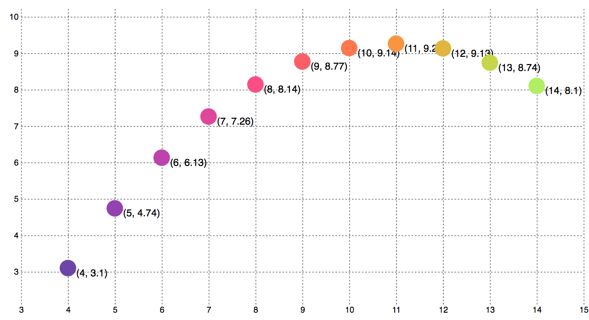

# Anscombe Quartet Scatter Plot - Part One

Now that we have had a chance to explore Anscombe's Quartet a bit, let's plot it out with D3! :D

Our creation will end up looking something like this:



You can find a completed version of this on [my bl.ocks page](https://bl.ocks.org/molliemarie/f30308e1c28a3fbda8eda6c72cfa9fc7).

**Note:** Since Mike doesn't [technically](https://bl.ocks.org/mbostock/3887118) make valid HTML pages, we're not going to either — here's how we'll start our own empty HTML pages from here on out:

  ```
  <!DOCTYPE html>
  <meta charset="utf-8">

  <style type="text/css">
    /*css to go here*/
  </style>

  <body></body>

 <script src="https://d3js.org/d3.v4.min.js"></script>
 
  <script>
    //JS to go here
  </script>

  ```

  
First, go to [this pen](https://codepen.io/molliemarie/pen/vQwrBm) and fork it. You'll notice the code is set up like above, plus I've added styling that will add a pink border around any svg we might draw.

Let's get started!!

**Steps**
1. Create an svg
2. Using a data join, add a circle for every element of our array.
3. Position the circles based on their x and y attributes.
4. Add a scale!
5. Add text to circles labeling the coordinate positions
6. Redo original join using groups
7. Add axes
8. Add margins
9. Add gridlines
10. Add colorscale
11. Add hover interactions
12. Add buttons / dataswap function if time
